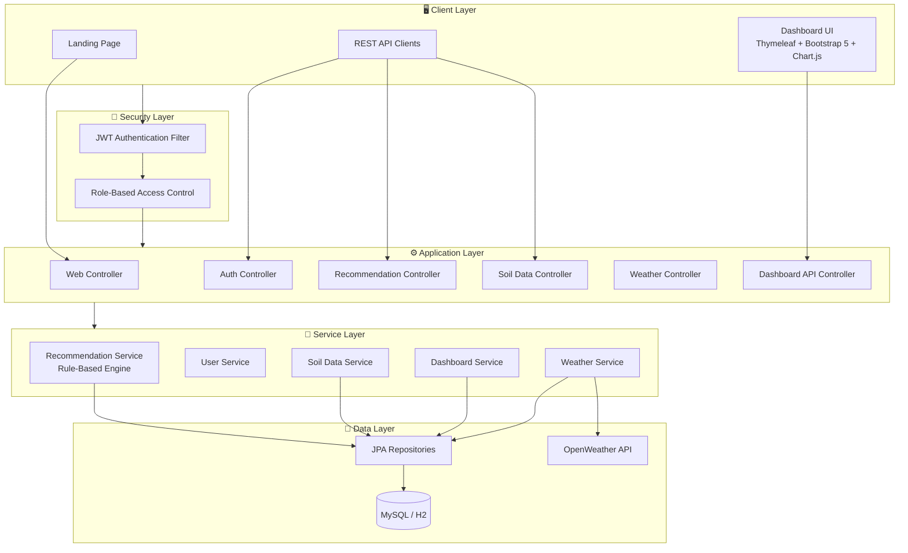

<p align="center">
  <h1 align="center">🌿 SmartCrop — Crop Recommendation System</h1>
  <p align="center">
    An intelligent, full-stack crop recommendation platform that analyzes soil nutrients and climate data to deliver data-driven recommendations for optimal crop selection.
  </p>
</p>

<p align="center">
  
  
  
  
  
</p>

---

## 📋 Table of Contents

- [Overview](#-overview)
- [Features](#-features)
- [Architecture](#-architecture)
- [Tech Stack](#-tech-stack)
- [Project Structure](#-project-structure)
- [Quick Start](#-quick-start)
- [API Reference](#-api-reference)
- [Default Users](#-default-users)
- [Screenshots](#-screenshots)
- [Roadmap](#-roadmap)
- [Contributing](#-contributing)
- [License](#-license)

---

## 🌱 Overview

SmartCrop is a production-ready crop recommendation system built with **Spring Boot** that helps farmers make data-driven decisions. It analyzes soil parameters (Nitrogen, Phosphorus, Potassium, pH) along with real-time weather data to recommend the most suitable crop with a confidence score.

**Key Highlights:**
- 🧪 Rule-based recommendation engine matching soil profiles to ideal crop ranges
- 🌤️ Real-time weather integration via OpenWeather API
- 📊 Interactive dashboards with Chart.js visualizations
- 🔐 JWT-based authentication with role-based access control (Admin, Farmer, Officer)
- 🐳 Docker-ready for one-command deployment

---

## ✨ Features

| Feature | Description |
|---------|-------------|
| **Soil Analysis** | Submit NPK, pH, and moisture data for intelligent crop matching |
| **Weather Integration** | Live weather data from OpenWeather API for climate-aware recommendations |
| **Smart Recommendations** | Algorithm matches soil + climate to crop ideal ranges with confidence scoring |
| **Role-Based Dashboards** | Farmer (NPK trends), Admin (crop analytics), Officer (weather trends) |
| **JWT Authentication** | Secure login with BCrypt passwords and HTTP-only cookie sessions |
| **Modern Landing Page** | Beautiful hero section with feature cards and gradient design |
| **Responsive UI** | Mobile-friendly dashboard built with Bootstrap 5 + custom CSS |
| **RESTful API** | Complete API for programmatic access to all features |
| **Docker Support** | One-command deployment with MySQL via Docker Compose |

---

## 🏗️ Architecture



**Data Flow:**
1. User submits soil data (NPK, pH, moisture) + optional location
2. System fetches real-time weather if location provided
3. Recommendation engine scores all crops against soil/climate parameters
4. Best match returned with confidence score and persisted to database
5. Dashboard visualizations update with new data

---

## 🛠️ Tech Stack

| Layer | Technology |
|-------|------------|
| **Backend** | Spring Boot 3.2, Spring Web, Spring Data JPA, Spring Security |
| **Frontend** | Thymeleaf, Bootstrap 5, Chart.js, Custom CSS |
| **Database** | MySQL 8.x (production) · H2 (demo mode) |
| **Authentication** | JWT + BCrypt, HTTP-only cookies |
| **External API** | OpenWeather API |
| **Build** | Maven 3.8+, Maven Wrapper |
| **DevOps** | Docker, Docker Compose |
| **Language** | Java 17 |

---

## 📁 Project Structure

```
crop-recommendation-system/
├── 📄 README.md
├── 📄 LICENSE                         # MIT License
├── 📄 CONTRIBUTING.md                 # Contribution guidelines
├── 📄 CHANGELOG.md                    # Version history
├── 📄 .env.example                    # Environment template
├── 📄 .gitignore
├── 🐳 Dockerfile
├── 🐳 docker-compose.yml
├── 📄 pom.xml
├── 📄 run.ps1                         # Quick start script
│
├── src/main/java/com/crop/
│   ├── 🚀 CropRecommendationApplication.java
│   │
│   ├── config/                        # Configuration
│   │   ├── SecurityConfig.java        #   Spring Security + JWT setup
│   │   ├── WebClientConfig.java       #   WebClient for external APIs
│   │   └── DataLoader.java            #   Database seeding
│   │
│   ├── controller/                    # Request Handlers
│   │   ├── WebController.java         #   Thymeleaf page routes
│   │   ├── AuthController.java        #   Login/Register REST API
│   │   ├── RecommendationController.java
│   │   ├── SoilDataController.java
│   │   ├── WeatherController.java
│   │   ├── CropController.java
│   │   └── DashboardApiController.java
│   │
│   ├── service/                       # Business Logic
│   │   ├── RecommendationService.java #   🧠 Core recommendation engine
│   │   ├── UserService.java
│   │   ├── SoilDataService.java
│   │   ├── WeatherService.java
│   │   └── DashboardService.java
│   │
│   ├── repository/                    # Data Access
│   │   ├── CropRepository.java
│   │   ├── RecommendationRepository.java
│   │   ├── SoilDataRepository.java
│   │   ├── UserRepository.java
│   │   └── WeatherDataRepository.java
│   │
│   ├── entity/                        # Database Models
│   │   ├── User.java
│   │   ├── Crop.java
│   │   ├── Recommendation.java
│   │   ├── SoilData.java
│   │   ├── WeatherData.java
│   │   └── enums/Role.java
│   │
│   ├── dto/                           # Data Transfer Objects
│   │   ├── LoginRequest.java
│   │   ├── LoginResponse.java
│   │   ├── RegisterRequest.java
│   │   ├── RecommendationRequest.java
│   │   ├── RecommendationResponse.java
│   │   ├── SoilDataRequest.java
│   │   ├── WeatherResponse.java
│   │   └── ApiError.java
│   │
│   ├── security/                      # Authentication
│   │   ├── JwtAuthenticationFilter.java
│   │   ├── JwtUtil.java
│   │   └── CustomUserDetailsService.java
│   │
│   └── exception/                     # Error Handling
│       ├── GlobalExceptionHandler.java
│       ├── BadRequestException.java
│       └── ResourceNotFoundException.java
│
├── src/main/resources/
│   ├── templates/                     # Thymeleaf Views
│   │   ├── home.html                  #   Landing page
│   │   ├── login.html
│   │   ├── register.html
│   │   └── dashboard.html             #   Main dashboard
│   ├── static/css/
│   │   └── style.css                  #   Custom styles
│   ├── application.properties         #   MySQL config
│   └── application-demo.properties    #   H2 demo config
│
├── database/
│   └── schema.sql                     # DDL + sample data
│
└── docs/
    └── CNDC_Justification.md          # Architecture decisions
```

---

## 🚀 Quick Start

### Option 1: PowerShell Script (Easiest)

```powershell
# Production (MySQL required)
.\run.ps1

# Demo mode (no MySQL needed — uses H2 in-memory database)
.\run.ps1 -Demo
```

### Option 2: Maven

```bash
# With MySQL
mvn spring-boot:run

# With H2 (demo)
mvn spring-boot:run -Dspring-boot.run.profiles=demo
```

### Option 3: Docker (Full Stack)

```bash
mvn clean package -DskipTests
docker compose up -d --build
```

**Access:** http://localhost:8080

### Prerequisites

| Requirement | For Production | For Demo |
|------------|---------------|----------|
| JDK 17+ | ✅ Required | ✅ Required |
| MySQL 8.x | ✅ Required | ❌ Not needed |
| Maven | ✅ Or use `mvnw` | ✅ Or use `mvnw` |
| Docker | ❌ Optional | ❌ Optional |

### MySQL Setup

```sql
-- Database is auto-created if URL has createDatabaseIfNotExist=true
-- Or create manually:
CREATE DATABASE IF NOT EXISTS crop_recommendation_db;
```

Update `src/main/resources/application.properties` with your MySQL password:

```properties
spring.datasource.username=root
spring.datasource.password=YOUR_PASSWORD
```

---

## 📡 API Reference

All API endpoints require JWT authentication (except auth endpoints).

### Authentication

| Method | Endpoint | Description |
|--------|----------|-------------|
| `POST` | `/api/auth/login` | Login, returns JWT |
| `POST` | `/api/auth/register` | Register new user |

### Core APIs

| Method | Endpoint | Role | Description |
|--------|----------|------|-------------|
| `POST` | `/api/recommendation` | FARMER+ | Get crop recommendation |
| `POST` | `/api/soil` | FARMER+ | Submit soil data |
| `GET` | `/api/soil` | FARMER+ | List user's soil data |
| `GET` | `/api/weather/current?location=X` | ALL | Fetch & store weather |

### Dashboard APIs

| Method | Endpoint | Role | Description |
|--------|----------|------|-------------|
| `GET` | `/api/dashboard/farmer` | FARMER | NPK trends + recommendations |
| `GET` | `/api/dashboard/admin` | ADMIN | Most recommended crops |
| `GET` | `/api/dashboard/officer?location=X` | OFFICER | Weather trends |

### Example: Get Recommendation

```bash
# 1. Login
TOKEN=$(curl -s -X POST http://localhost:8080/api/auth/login \
  -H "Content-Type: application/json" \
  -d '{"email":"farmer@crop.com","password":"password123"}' | jq -r '.token')

# 2. Get recommendation
curl -X POST http://localhost:8080/api/recommendation \
  -H "Authorization: Bearer $TOKEN" \
  -H "Content-Type: application/json" \
  -d '{
    "soilData": {
      "nitrogen": 90, "phosphorus": 42,
      "potassium": 43, "ph": 6.5, "moisture": 50
    },
    "location": "London"
  }'
```

---

## 👥 Default Users

Created automatically by `DataLoader` on first run (password: **`password123`**):

| Email | Role | Dashboard |
|-------|------|-----------|
| `admin@crop.com` | ADMIN | Most recommended crops chart |
| `farmer@crop.com` | FARMER | NPK trends + recommendation history |
| `officer@crop.com` | OFFICER | Rainfall & temperature trends |

---

## 📸 Screenshots

> **Landing Page** — Modern hero section with feature cards

> **Dashboard** — NPK input with validation, recommendation result with confidence bar, trend charts

> **Login** — Clean authentication page

*Screenshots coming soon — run the app to see the full UI!*

---

## 🗺️ Roadmap

### v1.0.0 — ✅ Current Release
- [x] Core recommendation engine (rule-based)
- [x] JWT authentication with role-based access
- [x] Interactive dashboards with Chart.js
- [x] OpenWeather API integration
- [x] Modern landing page with feature cards
- [x] Docker support
- [x] H2 demo mode

### v1.1.0 — Planned
- [ ] ML-based recommendation model (scikit-learn / TensorFlow)
- [ ] Crop disease detection module
- [ ] Multi-language support (i18n)
- [ ] Email notifications for recommendations

### v2.0.0 — Future
- [ ] AI recommendation module with historical data learning
- [ ] Analytics & reporting module
- [ ] Carbon credit tracking
- [ ] Admin panel with user management UI
- [ ] IoT sensor integration (MQTT)
- [ ] Mobile app (React Native / Flutter)

### Scalability Path

```
com.crop/
├── recommendation/    # AI + rule-based engines
├── analytics/         # Reports, trends, exports
├── carbon/            # Carbon credit tracking
├── admin/             # Admin panel controllers
├── notification/      # Email, SMS, push
└── iot/               # Sensor data ingestion
```

---

## 🤝 Contributing

Contributions are welcome! Please read [CONTRIBUTING.md](CONTRIBUTING.md) for guidelines.

---

## 📄 License

This project is licensed under the **MIT License** — see the [LICENSE](LICENSE) file for details.

---

## 🙏 Acknowledgments

- [Spring Boot](https://spring.io/projects/spring-boot) — Backend framework
- [OpenWeather API](https://openweathermap.org/api) — Weather data provider
- [Chart.js](https://www.chartjs.org/) — Dashboard visualizations
- [Bootstrap 5](https://getbootstrap.com/) — UI components

---

<p align="center">
  Made with ❤️ for smarter agriculture
</p>
